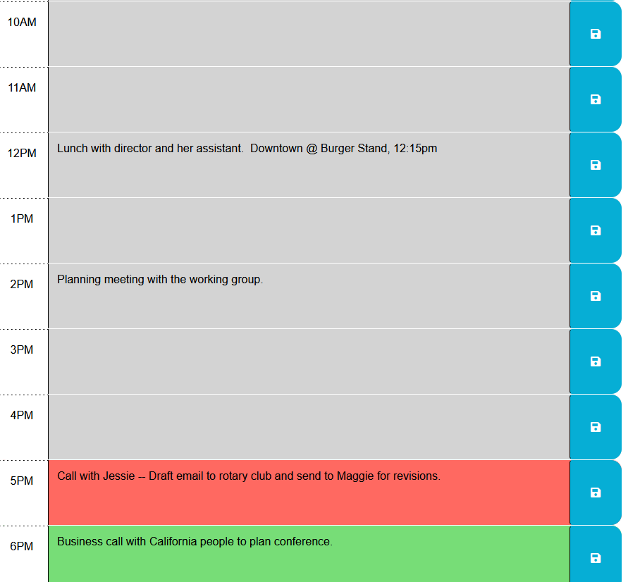

# Workday Planner

## Description

*Workday Planner* is a simple app for planning each business day (8am-7pm).  When you open or refresh the application in your web browser, time blocks that have passed are grey, the current hour's time block is red, and time blocks still in the future are green.  Saved events will persist between browser refresh or closing and re-opening the application.  The application is built with [jQuery](https://jquery.com/), [dayjs](https://day.js.org/), and the [Bootstrap](https://getbootstrap.com/) UI library.

**Visit the application here**: [https://kitrath.github.io/workday-planner/](https://kitrath.github.io/workday-planner/)

## Usage

Enter the day's plans for each hour in the corresponding time block.  Click the blue save button on the right hand side of the application to save events between browser refresh or if closing the application.  To completely delete text from a time block, remove the text and then click the save button.

## Screenshot

## Roadmap
 - Allow user to choose time range for displayed time blocks.
 - Offer dropdown select where user's can label and store entire days for easy reload.
 - Add delete button on each time block to easily clear text.

